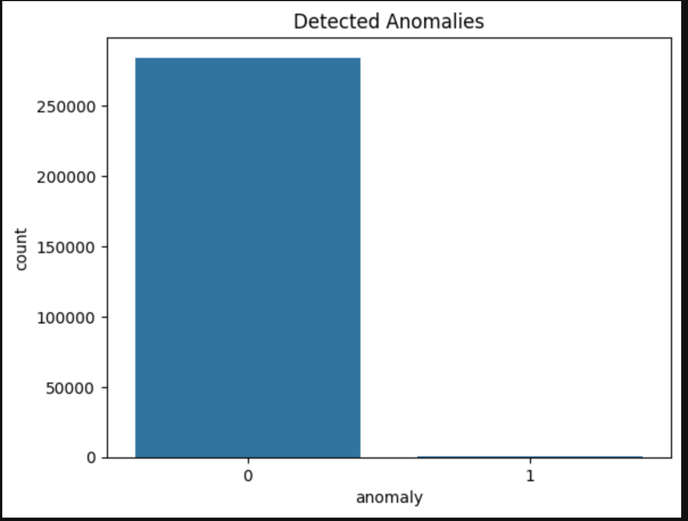

# 🔍 Anomaly Detection in Credit Card Transactions

## 📌 Project Overview

This project focuses on detecting fraudulent credit card transactions using machine learning-based anomaly detection techniques. Due to the highly imbalanced nature of the dataset, identifying rare fraudulent events is a challenging real-world problem.

---

## 🎯 Objective

* Detect anomalous (fraudulent) transactions from large-scale financial data
* Compare different anomaly detection algorithms
* Analyze model performance using appropriate evaluation metrics

---

## 📊 Dataset

* Source: Credit Card Fraud Detection Dataset (Kaggle)
* Total transactions: ~284,000
* Features: 30 (anonymized numerical features + Time + Amount)
* Target variable:

  * `0` → Normal transaction
  * `1` → Fraudulent transaction

---

## ⚙️ Technologies Used

* Python 🐍
* Pandas & NumPy
* Scikit-learn
* Matplotlib & Seaborn
* Jupyter Notebook

---

## 🤖 Models Implemented

### 1️⃣ Isolation Forest

* Detects anomalies by isolating observations
* Works well with high-dimensional data
* Efficient for large datasets

### 2️⃣ Local Outlier Factor (LOF)

* Detects anomalies based on local density deviation
* Useful for identifying local anomalies
* Computationally expensive for large datasets

---

## 📈 Evaluation Metrics

* Precision
* Recall
* F1-score
* Confusion Matrix

> Note: Due to dataset imbalance, precision and recall are more important than accuracy.

---

## 📊 Results & Insights

* Dataset is highly imbalanced, with very few fraudulent cases
* Isolation Forest performed better for large-scale anomaly detection
* LOF provided useful insights but required sampling due to computational cost
* Trade-off observed between precision and recall

---

## 🧠 Key Learnings

* Handling imbalanced datasets in real-world scenarios
* Importance of selecting appropriate evaluation metrics
* Trade-offs between different anomaly detection algorithms
* Practical challenges in scaling machine learning models

---

## 📁 Project Structure

```
Anomaly-Detection/
│
├── Anomaly_Detection.ipynb
├── creditcard.csv
└── README.md
```

---

## 🚀 Future Improvements

* Implement deep learning-based anomaly detection
* Deploy as a web application (Streamlit)
* Use real-time transaction data
* Hyperparameter tuning for improved performance

---

## 💡 Conclusion

This project demonstrates the application of machine learning techniques for detecting anomalies in financial transactions. It highlights the challenges of working with imbalanced datasets and the importance of selecting the right models and evaluation strategies.

---

## 📸 Results



---

## 👨‍💻 Author

Adarsh Patane
B.Tech Computer Engineering Student

---
